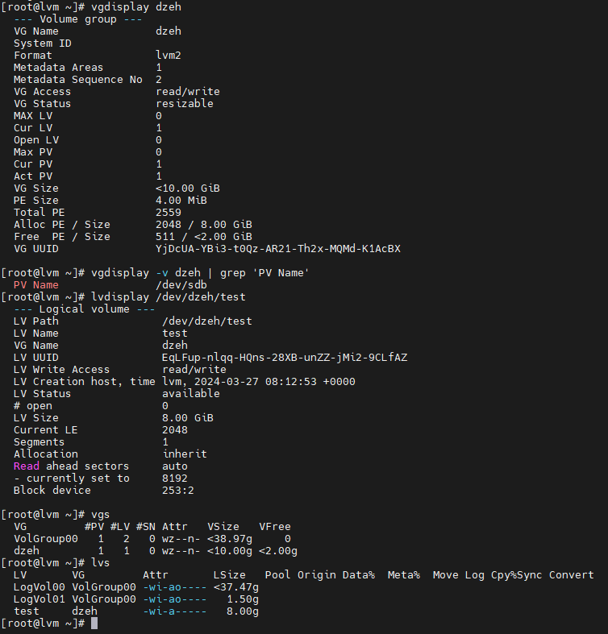
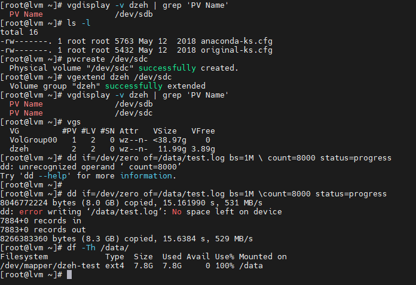
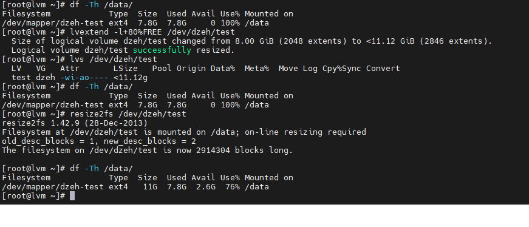

# lmv
1. проверяем наличие Vagrant plugins командой ``` vagrant plugin list ```
2. В выводе должен быть ``` vagrant-vbguest ``` если этого плагина нет, то устанавливаем ``` vagrant plugin install vagrant-vbguest ```
3. Далее из директории **lvm** поднимаем виртуальную машину ``` vagrant up ```
4.  Далее создали PV, VG 'dzeh', LV 'test' 
5.  
6.  Расширение LVM  и Сымитируем занятое место с помощью команды **dd** для большей наглядности
7.   
8.   Увеличим **/dev/dzeh/test** и сделаем  resize2fs (resize файловой системы)
9.   
10.   Далее нужно уменьшить существующий **LV** с помощью команды **lvreduce**, но перед этим необходимо отмонтировать файловую систему, проверить её на ошибки и уменьшить ее размер:
11.   
