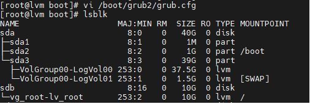

# lmv
## Домашнее задание
### Уменьшить том под / до 8G
1. 
2. ``` ls /mnt ```
3. ``` for i in /proc/ /sys/ /dev/ /run/ /boot/; do mount --bind $i /mnt/$i; done ```
4. ``` chroot /mnt/ ```
5. ``` grub2-mkconfig -o /boot/grub2/grub.cfg ```
6. в файле **/boot/grub2/grub.cfg** заменить **rd.lvm.lv=VolGroup00/LogVol00** на **rd.lvm.lv=vg_root/lv_root**
7. 
8. удаляем старый LV размером в 40G и создаём новый на 8G:
9. ``` lvremove /dev/VolGroup00/LogVol00 ```
10. 
11.  ``` mkfs.xfs /dev/VolGroup00/LogVol00 ```
12.  ``` mount /dev/VolGroup00/LogVol00 /mnt ```
13.  ``` xfsdump -J - /dev/vg_root/lv_root | \ xfsrestore -J - /mnt ```
14.  
15.  Сконфигурируем grub, за исключением правки /etc/grub2/grub.cfg
16.  ``` for i in /proc/ /sys/ /dv/ /run/ /boot/; do mount --bind $i /mnt/$i; done ```
17.  ``` chroot /mnt/ ```
18.  ``` grub2-mkconfig -o /boot/grub2/grub.cfg ```
19.  
### Выделить том под /var в зеркало
1.  На свободных дисках создаем зеркало -->  Создаем на нем ФС и перемещаем туда /var: --> Ну и монтируем новый var в каталог /var:
2.  
3.   Правим fstab для автоматического монтирования /var:  ``` [root@lvm boot]# echo "`blkid | grep var: | awk '{print $2}'` /var ext4 defaults 0 0" >> /etc/fstab ```   и **перезагружаемся**
4.   

 
